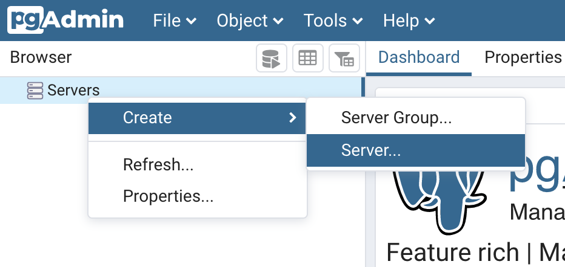
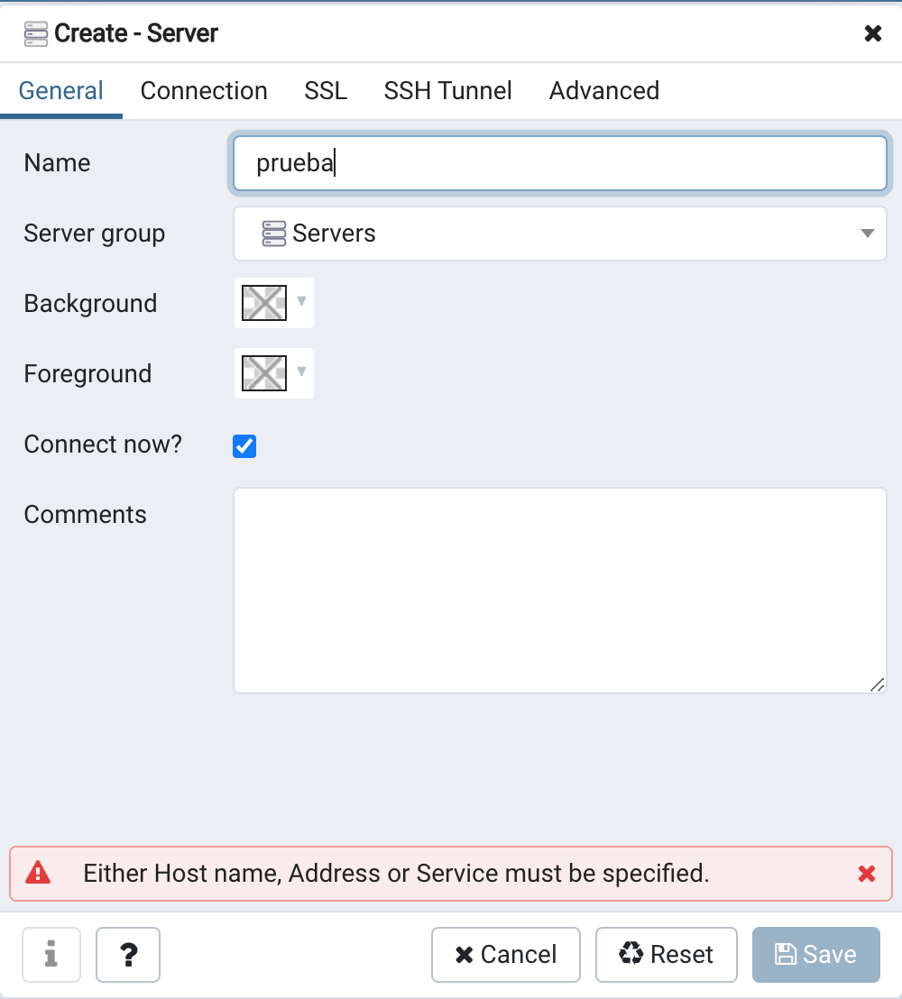
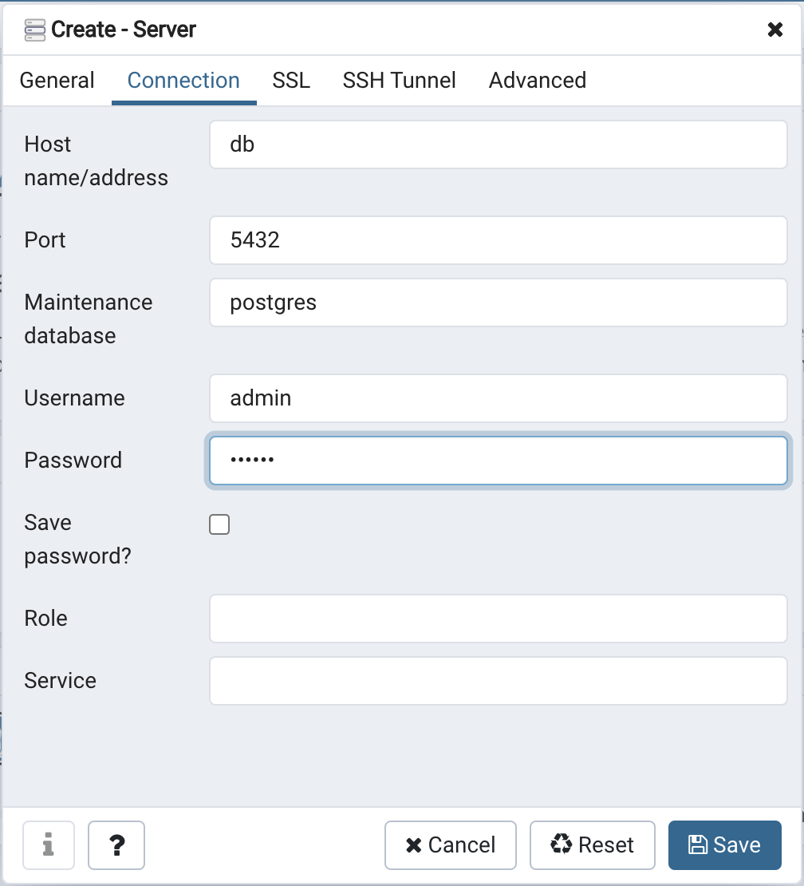

# Example: Configuring PostgreSQL with pgAdmin using Docker Compose

This example will guide you through deploying a PostgreSQL container and visualizing it with pgAdmin using Docker Compose to orchestrate the services.

## Step 1: Start the Services

Run the following command to build and start the containers in the background:

```
docker-compose up -d --build
```

Wait until both containers are ready.

## Step 2: Access pgAdmin

Once the containers are running, you can access pgAdmin through your browser at the following URL:

- URL: http://0.0.0.0:8080

Log in with the credentials defined in the docker-compose.yml file:

- Email: admin@example.com
- Password: secret123

## Step 3: Create a New Server in pgAdmin

To connect to your PostgreSQL container, create a new server in pgAdmin by following these steps:

1. Click on Add New Server.

2. Enter a name for the server, for example, My Postgres.

3. In the Connection tab, use the following credentials configured in the db service:

- **Hostname**: db (the service name in Docker Compose)
- **Username**: admin
- **Password**: secret123

Next, click **Save** to establish the connection.

Here are some screenshots to help guide you through this configuration:




## Step 4: Explore and Manage the Database

Once connected to the PostgreSQL server, you can start exploring and managing the database through pgAdmin's interface. If you want to create tables and manage data, I recommend following this additional guide:

- **Guide**: Creating and managing tables with pgAdmin

## Step 5: Stop and Clean Up the Containers

When you're done using the containers, it's important to stop and clean up the resources to avoid unnecessary consumption. Run the following command to stop and remove the containers, volumes, and downloaded images:

```
docker-compose down -v --rmi all
```

This command:

- Stops the containers.
- Removes the containers and created volumes.
- Deletes the images downloaded from the Docker registry.

This process ensures that your environment is clean after the session.

## My Solution ✅

My `docker-compose.yaml` file it's located in /docker/exercises directory.

Steps I followed to solve this exercise:

1. Get the official image for pgadmin from the docs: https://hub.docker.com/r/dpage/pgadmin4/
2. Check env. variables for the container from docs: https://www.pgadmin.org/docs/pgadmin4/latest/container_deployment.html#environment-variables

<!-- In case I want to add volumes: 
Read about PGDATA for volumes in docs https://hub.docker.com/_/postgres:

#### PGDATA
`Important Note: when mounting a volume to /var/lib/postgresql, the /var/lib/postgresql/data path is a local volume from the container runtime, thus data is not persisted on the mounted volume.` -->

3. Create the `docker-compose.yaml` file

After successfully created the ```docker-compose.yaml file```, perform STEP 1:

```
docker compose up -d --build
```


I can see the mydb database defined in docker-compose.yaml file: ```POSTGRES_DB: mydb```


4. Explore and Manage the Database

Create tables:


Add data to tables:


```INSERT SCRIPT```


5. Stop and Clean Up the Containers

```
docker compose down -v --rmi all
```


